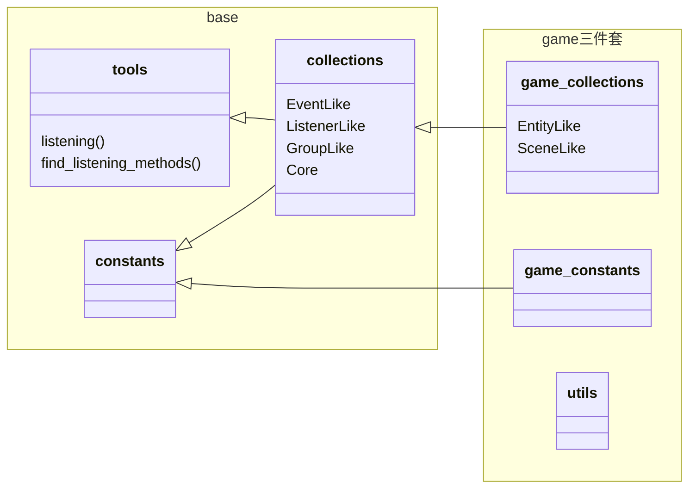
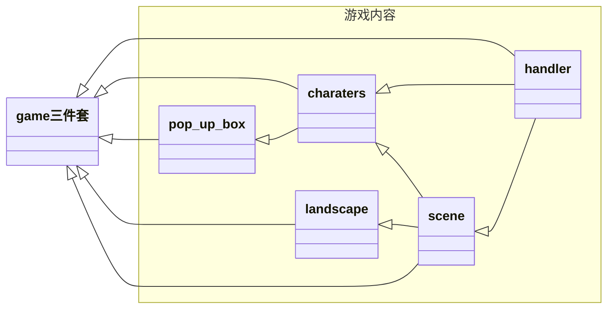
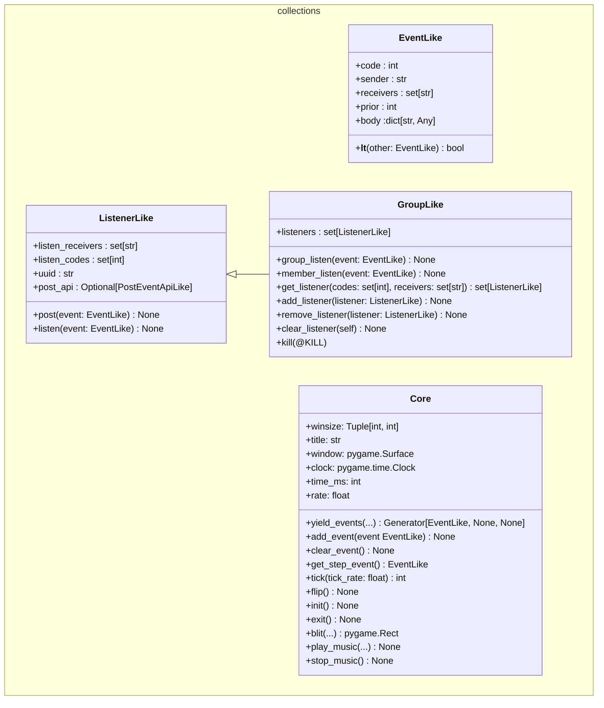
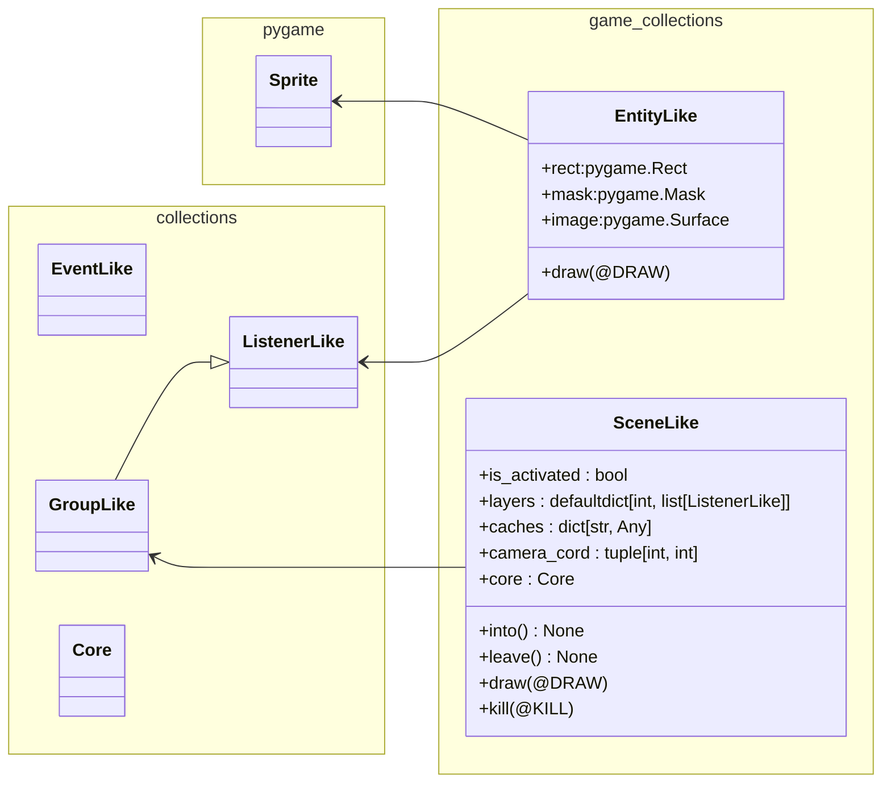

* [代码结构](#代码结构)
  * [文件依赖关系](#文件依赖关系)
  * [基类`base/collections.py`](#基类`base/collections.py`)
  * [游戏基类`game_collections.py`](#游戏基类`game_collections.py`)
* [代码规范](#代码规范)
  * [`ListenerLike`子类的注释风格补充说明](#`ListenerLike`子类的类注释补充说明)

# [SI100B_DIE_Fall_2024_Repo](https://github.com/teafrogsf/SI100B_DIE_Fall_2024_Repo)版本备注

* 仓库中的`base`（`tools.py`、`collections.py`、`constants.py`）以及`game三件套`（`game_collections.py`、`game_constants.py`、`utils.py`）是**完整提供**的。但「游戏内容」部分的代码会有<u>部分或全部删减</u>。
* **Baseline不强制要求使用**，但希望能提供一些帮助。
* 后期维护中，可能会更新文档、注释、甚至修复漏洞。请注意`commits`。

> * `hello_world.py`是可以运行的小样例。

# 代码结构

* 本项目基于`python 3.8+`
* 依赖的第三方包有
  * `pygame`——游戏库
  * `loguru`——日志库

## 文件依赖关系

> 箭头代表依赖关系，箭头指向被依赖的文件。

* `base`——事件系统
  * `tools.py`——工具函数/类提供（比如`listening`装饰器）
  * `collections.py`——定义「事件队列`Core`」、「事件`Event`」、「监听者`ListenerLike`」三件套以及一些额外内容
  * `constants.py`——常量集（比如事件代码`EventCode`等）
* `game三件套`——常用游戏工具库
  * `game_collections.py`——常用游戏实体（实体`EntityLike`以及场景`SceneLike`）
  * `game_constants.py`——常量集（比如事件代码等）
  * `utils.py`——杂项工具库



---



## 基类`base/collections.py`

本文件定义了<u>事件相关基础类型</u>，本项目几乎全部游戏内容类都继承自`ListenerLike`。

* `EventLike`
  *  事件
* `ListenerLike`
  * 监听器，主要实现`listen`和`post`方法
* `GroupLike`
  * 监听器群组，其`listen`方法接收的事件由群组处理，然后分配给其成员
* `Core`
  *  核心。管理「事件队列」、「窗口」、「刻」以及一些「`pygame api`」



## 游戏基类`game_collections.py`

* `EntityLike`
  * 实现了`rect`、`mask`、`image`，并且能接收`DRAW`事件绘制自身
* `SceneLike`
  * 管理场景内容，并提供了图层机制（接收`DRAW`事件会根据图层顺序渲染场景实体）



# 代码规范

* 格式化请使用**black-formatter**插件
* 代码命名风格请参考[PEP8](https://peps.python.org/pep-0008/)，请安装**pylint**插件进行风格检查
* 函数和类的`docstring`风格请参考**[NumPy-style function annotations](https://numpydoc.readthedocs.io/en/latest/format.html)**
* 尽可能地**标注类型**

## `ListenerLike`子类的注释风格补充说明

### 类注释

如果一个`ListenerLike`存在被`listening`装饰过的方法，请在「类注释」中的`Listening Methods`章节进行说明。格式如下：

```python
"""
Listening Methods
---
方法名1@事件代码
    简述功能...
方法名2@事件代码1, 事件代码2
    简述功能...
"""
```


### 类注释示例

```python
class Player(ListenerLike):
    """
    
    ...其他内容...
    
    Listening Methods
    ---
    draw@DRAW
        绘制
    move@pygame.KEYDOWN, pygame.KEYUP
    	移动
    
    ...其他内容...
    
    """
    @listening(DRAW)
    def draw(self, event: EventLike):
        ...
	
    @listening(pygame.KEYDOWN)
    @listening(pygame.KEYUP)
    def move(self, event: EventLike):
        ...
```

### 方法注释

被`listening`修饰的方法都应在函数注释的`Listening`章节标注，格式为

```python
"""
Listening
---
事件代码 : 事件body格式
    body的键1 : body的值1类型
        简述作用...
    body的键2 : body的值2类型
        简述作用...
"""
```

> * 事件body格式一般是继承了`TypeDict`的类型。如果没有格式要求，请直接填`dict`。

如果方法会发布事件，那么请在`Post`章节标注，格式为

```python
"""
Post
---
事件代码 : 事件body格式
    body的键1 : body的值1类型
        简述作用...
    body的键2 : body的值2类型
        简述作用...
"""
```

> * 事件body格式一般是继承了`TypeDict`的类型。如果没有格式要求，请直接填`dict`。

### 方法注释示例

```python
@listening(DRAW)
def draw(self, event: EventLike):
    """
    在画布上绘制实体

    Listening
    ---
    DRAW : DrawEventBody
        window : pygame.Surface
        	画布
        camera : tuple[int, int]
        	镜头坐标（/负偏移量）
    """
    body: DrawEventBody = event.body
    window: pygame.Surface = body["window"]
    camera: Tuple[int, int] = body["camera"]
```

> DrawEventBody是`TypeDict`字典类型标注
>
> ```python
> class DrawEventBody(typing.TypedDict):
>        window: pygame.Surface  # 画布
>        camera: tuple[int, int]  # 镜头坐标（/负偏移量）
> ```

---

```python
@listening(CollisionEventCode.COLLISION_EVENT)
def collision(self, event: EventLike):
    """
    碰撞事件。如果碰撞来自玩家, 那么会切换到战斗场景。

    Listening
    ---
    CollisionEventCode.COLLISION_EVENT : CollisionEventBody
        sender: str
            碰撞来源UUID
        charater_type: CharaterType
            碰撞来源类型

    Post
    ---
    SceneEventCode.CHANGE_SCENE : ChangeSceneEventBody
        new_scene : SceneLike
            即将切换到的新场景
    """
    body: CollisionEventBody = event.body
    if body["charater_type"] == CharaterType.PLAYER:
        body: ChangeSceneEventBody = {
            "new_scene": BattleBox(self.scene.core, self.player, self, self.scene)
        }
        event = EventLike(SceneEventCode.CHANGE_SCENE, prior=301, body=body)
        self.post(event)
```

>`CollisionEventBody`，`ChangeSceneEventBody`是`TypeDict`字典类型标注
>
>```python
>class CollisionEventBody(typing.TypedDict):
>    sender: str
>    charater_type: CharaterType
>   
>class ChangeSceneEventBody(typing.TypedDict):
>    new_scene: SceneLike
>```
