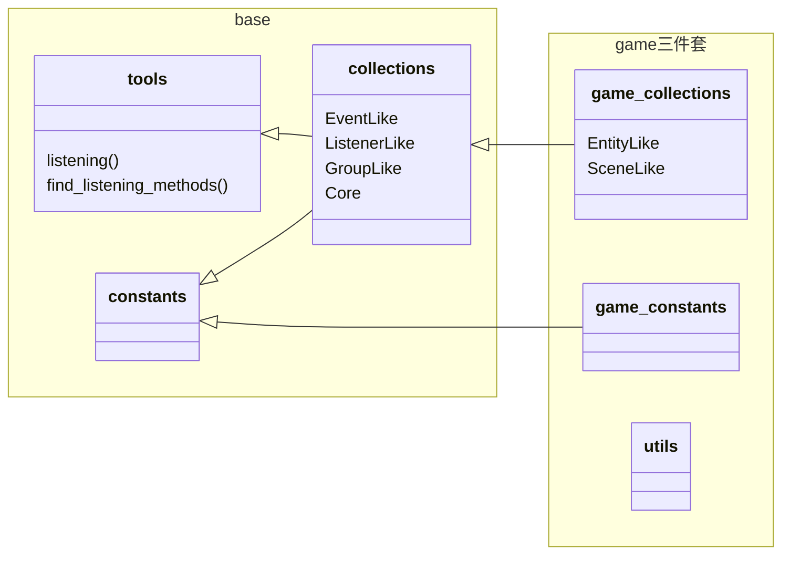
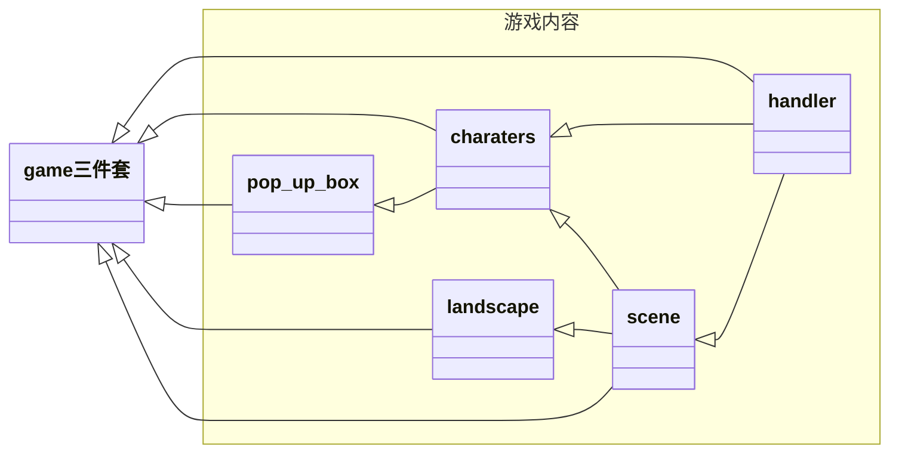
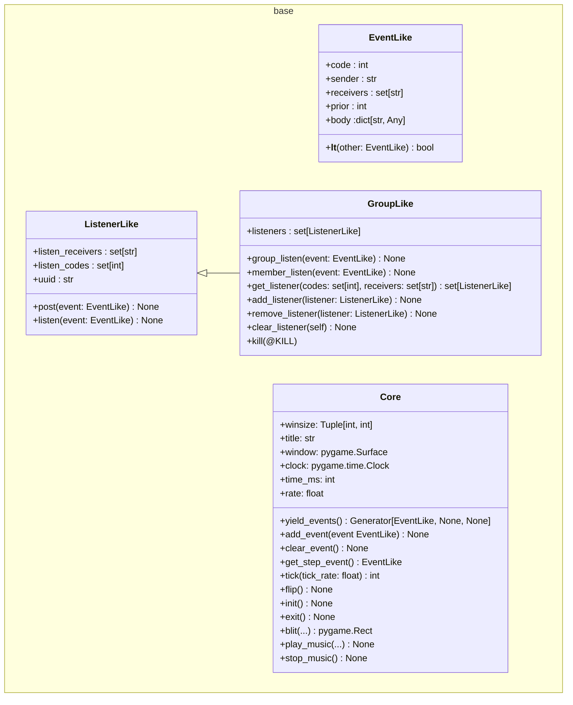
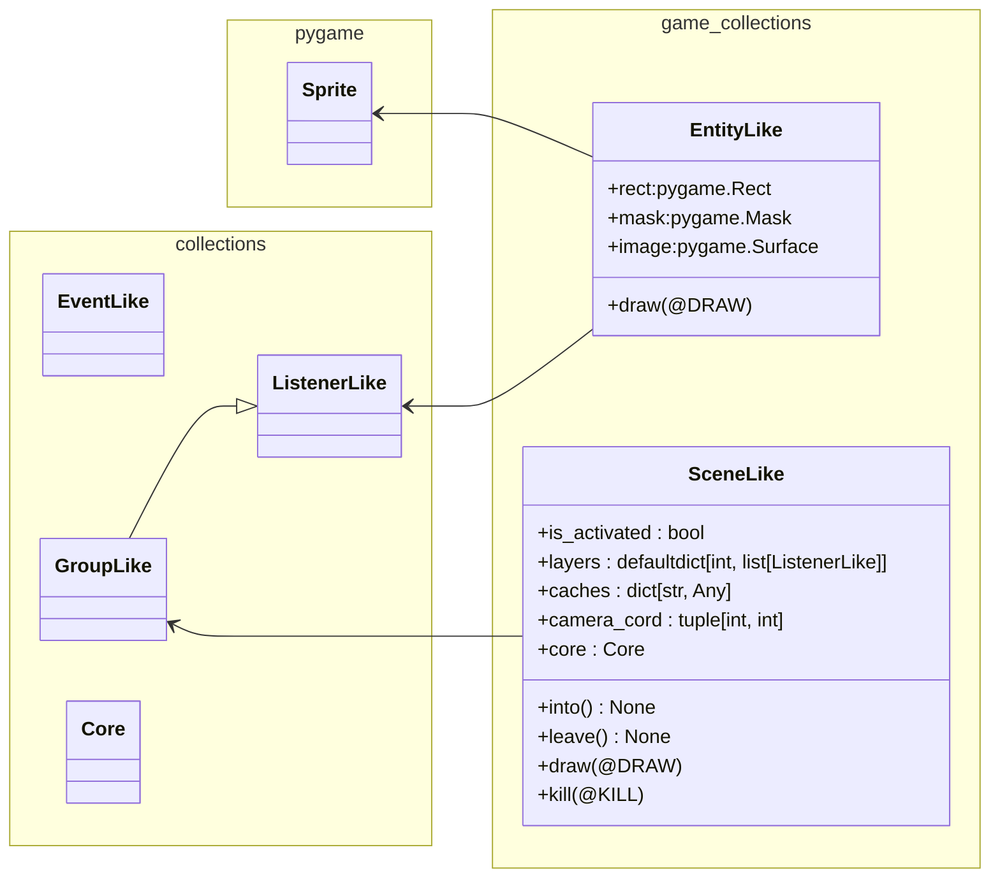

* [代码结构](#代码结构)
  * [文件依赖关系](#文件依赖关系)
  * [基类`base/collections.py`](#基类`base/collections.py`)
  * [游戏基类`game_collections.py`](#游戏基类`game_collections.py`)
* [代码规范](#代码规范)
  * [`ListenerLike`子类的注释风格补充说明](#`ListenerLike`子类的类注释补充说明)

# [SI100B_DIE_Fall_2024_Repo](https://github.com/teafrogsf/SI100B_DIE_Fall_2024_Repo)版本备注

* 仓库中的`base`（`tools.py`、`collections.py`、`constants.py`）以及`game三件套`（`game_collections.py`、`game_constants.py`、`utils.py`）是**完整提供**的。但「游戏内容」部分的代码会有<u>部分或全部删减</u>。
* **Baseline不强制要求使用**，但希望能提供一些帮助。

# 代码结构

* 本项目基于`python 3.8+`
* 依赖的第三方包有
  * `pygame`——游戏库
  * `loguru`——日志库

## 文件依赖关系

> 箭头代表依赖关系，箭头指向被依赖的文件。



---



## 基类`base/collections.py`

本文件定义了事件相关基础类型，本项目几乎全部游戏内容类都继承自`ListenerLike`。

* `EventLike`
  *  事件
* `ListenerLike`
  * 监听器
* `GroupLike`
  * 监听器群组
* `Core`
  *  核心。管理事件队列、窗口、刻、`pygame api`。



## 游戏基类`game_collections.py`



# 代码规范

* 格式化请使用**black-formatter**插件
* 代码命名风格请参考[PEP8](https://peps.python.org/pep-0008/)，请安装**pylint**插件进行风格检查
* 函数和类的`docstring`风格请参考**[NumPy-style function annotations](https://numpydoc.readthedocs.io/en/latest/format.html)**
* 尽可能地**标注类型**

## `ListenerLike`子类的注释风格补充说明

### 类注释

如果一个`ListenerLike`存在被`listening`装饰过的方法，请在「类注释」中的`Listening Methods`章节进行说明。

```python
class Player(ListenerLike):
    """
    ...
    Listening Methods
    ---
    draw@DRAW
        绘制
    move@pygame.KEYDOWN, pygame.KEYUP
    	移动
    ...
    """
    @listening(DRAW)
    def draw(self, event: EventLike):
        ...
	
    @listening(pygame.KEYDOWN)
    @listening(pygame.KEYUP)
    def move(self, event: EventLike):
        ...
```

### 方法注释

```python
@listening(DRAW)
def draw(self, event: EventLike):
    """
    绘制在画布上绘制实体

    Listening
    ---
    DRAW : DrawEventBody
        window : pygame.Surface
        	画布
        camera : tuple[int, int]
        	镜头坐标（/负偏移量）
    """
    body: DrawEventBody = event.body
    window: pygame.Surface = body["window"]
    camera: Tuple[int, int] = body["camera"]
```

> DrawEventBody是`TypeDict`字典类型标注
>
> ```python
> class DrawEventBody(typing.TypedDict):
>     window: pygame.Surface  # 画布
>     camera: tuple[int, int]  # 镜头坐标（/负偏移量）
> ```
